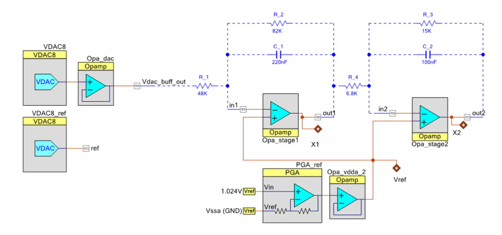

# Automatización y Control Digital

**Ingeniería Electrónica — Universidad Católica Nuestra Señora de la Asunción**  
**Autores:** Elías Álvarez · Tania Romero

---

## Descripción

Repositorio de la materia de **Automatización / Control Digital**. Contiene los informes técnicos y el código de implementación de nueve laboratorios progresivos y un trabajo práctico final sobre una planta experimental de helicóptero vertical.

La secuencia de laboratorios cubre el ciclo completo del diseño de controladores digitales: desde el clásico PID hasta el regulador óptimo LQG con filtro de Kalman. Todos los diseños son simulados en MATLAB y luego implementados físicamente en un microcontrolador PSoC.

---

## Estructura del repositorio

```
Auto/
├── Lab1/                    # PID — diseño e implementación
├── Lab2/                    # Lugar de raíces en tiempo discreto
├── Lab3/                    # Diseño por respuesta en frecuencia (Bode)
├── Lab4/                    # Método de Truxal–Ragazzini / Dead-beat
├── Lab5/                    # Ubicación arbitraria de polos (espacio de estados)
├── Lab6/                    # Estimadores de estado (predicción y actualización)
├── Lab7/                    # Realimentación de estados con acción integral
├── Lab8/                    # Control óptimo LQR con integrador (LQI)
├── Lab9/                    # Filtro de Kalman y regulador LQG
│
├── TPF-HelicopteroVertical/ # Trabajo Práctico Final (ver sección abajo)
│
├── MatLab_Projects/         # Proyectos MATLAB agrupados por laboratorio
├── PSoC_Projects/           # Proyectos PSoC Creator agrupados por laboratorio
├── third_party/             # Bibliotecas externas (CMSIS-DSP, CMSIS_5)
│
├── planta.png               # Esquema de la planta analógica de laboratorio
└── circuito_auxiliar.png    # Circuito auxiliar de medición
```

---

## Laboratorios

| Lab | Tema | Método | PDF |
|-----|------|--------|-----|
| [Lab 1](Lab1/) | Controlador PID | Ziegler–Nichols, ajuste manual | — |
| [Lab 2](Lab2/) | Lugar de raíces discreto | Root locus en plano-z | `document.pdf` |
| [Lab 3](Lab3/) | Compensadores en frecuencia | Diagrama de Bode discreto | `document.pdf` |
| [Lab 4](Lab4/) | Truxal–Ragazzini / Dead-beat | Síntesis directa de FT lazo cerrado | `Lab4Auto_EAyTR.pdf` |
| [Lab 5](Lab5/) | Ubicación de polos | Espacio de estados, fórmula de Ackermann | `lab5Auto_EAyTR.pdf` |
| [Lab 6](Lab6/) | Estimadores de estado | Observador de predicción y de actualización | `document.pdf` |
| [Lab 7](Lab7/) | Realimentación + integrador | Control en lazo cerrado con seguimiento | `lab7_Tania_Elias.pdf` |
| [Lab 8](Lab8/) | Control óptimo LQI | LQR con estado aumentado (integrador de error) | `Auto_Lab8_EA y TR.pdf` |
| [Lab 9](Lab9/) | Kalman + LQG | Filtro de Kalman óptimo, regulador LQG completo | `EA_TR_lab9.pdf` |

Cada carpeta de laboratorio contiene:
- Informe en **LaTeX** (fuente `.tex` + figuras)
- Código **MATLAB** (scripts de diseño y simulación)
- Código **C** para **PSoC** (implementación de la ecuación en diferencias)
- PDF compilado del informe (donde disponible)

---

## Trabajo Práctico Final — Helicóptero Vertical

**Planta:** sistema experimental de helicóptero vertical de un solo eje, tercer orden, inestable en lazo abierto, con actuador saturado y sensor láser ToF (TFmini Plus).  
**Hardware:** motor brushless + ESC, PSoC 5LP, sensor TFmini Plus, Arduino (GUI de monitoreo).

Ver [`TPF-HelicopteroVertical/`](TPF-HelicopteroVertical/) para detalles completos.

### Estrategias de control implementadas y comparadas

| Método | Descripción |
|--------|-------------|
| PID digital | Sintonía clásica como línea de base |
| Ubicación de polos + SS | Realimentación de estados directa |
| LQR | Regulador cuadrático lineal |
| LQR + Integrador | Seguimiento con error nulo en estado estacionario |
| LQG (LQR + Kalman) | Control óptimo con estimación de estados |

---

## Planta analógica de laboratorio

La planta utilizada en los Labs 1–9 es un circuito RC de segundo orden con amplificadores operacionales.

- **Función de transferencia continua:** obtenida analíticamente del circuito
- **Discretización:** ZOH (retención de orden cero) con `Ts = 1 ms`
- **Implementación digital:** ecuación en diferencias ejecutada en PSoC a 1 kHz
- **Adquisición:** conversores ADC/DAC del PSoC + comunicación UART con MATLAB



---

## Herramientas

- **MATLAB / Simulink** — diseño, simulación y validación de controladores
- **PSoC Creator** — implementación embebida en PSoC 5LP (Cypress)
- **LaTeX** (compilador `pdflatex`) — informes técnicos en formato IEEEtran
- **Arduino IDE** — GUI de monitoreo para el TPF

---

## Cómo compilar los informes

Cada informe tiene un `document.tex` principal (o similar). Se compila con:

```bash
pdflatex document.tex
bibtex document       # si usa bibliografía
pdflatex document.tex
pdflatex document.tex
```

Requiere los paquetes LaTeX: `amsmath`, `graphicx`, `siunitx`, `listings`, `IEEEtran`, `natbib`, `babel` (español).
